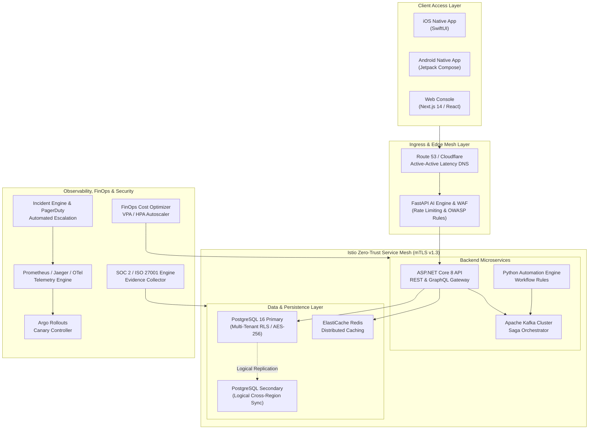

# NexusOps Enterprise - Production Operations Manual & Architecture Master Guide

Welcome to the definitive **Production Operations Manual & Architecture Master Guide** for **NexusOps Enterprise**. This document consolidates all platform components across Infrastructure-as-Code (IaC), Kubernetes orchestration, backend microservices, event saga engines, CI/CD automation, observability pipelines, zero-trust security controls, and native Android/iOS mobile SDKs.

---

## 1. Executive Platform Architecture Overview

NexusOps Enterprise is an enterprise-grade, multi-cloud, zero-trust operational platform engineered for high concurrency, multi-tenant isolation, automated progressive deployments, and real-time observability.

### High-Level Topology Architecture Diagram



---

## 2. Infrastructure-as-Code (Terraform) Operations

All infrastructure is declaratively defined using modular **Terraform** code located in [`terraform/`](file:///Users/mac/.gemini/antigravity/scratch/nexus-enterprise-platform/terraform).

### Directory Structure & Modules

* **Root Configuration**: [`main.tf`](file:///Users/mac/.gemini/antigravity/scratch/nexus-enterprise-platform/terraform/main.tf), [`variables.tf`](file:///Users/mac/.gemini/antigravity/scratch/nexus-enterprise-platform/terraform/variables.tf), [`outputs.tf`](file:///Users/mac/.gemini/antigravity/scratch/nexus-enterprise-platform/terraform/outputs.tf)
* **VPC Module**: [`terraform/modules/vpc/`](file:///Users/mac/.gemini/antigravity/scratch/nexus-enterprise-platform/terraform/modules/vpc) – Multi-AZ VPC with public/private subnets, NAT gateways, and VPC endpoints.
* **EKS Module**: [`terraform/modules/eks/`](file:///Users/mac/.gemini/antigravity/scratch/nexus-enterprise-platform/terraform/modules/eks) – Managed Kubernetes cluster with managed node groups, OIDC provider, and IAM roles for service accounts (IRSA).
* **RDS Module**: [`terraform/modules/rds/`](file:///Users/mac/.gemini/antigravity/scratch/nexus-enterprise-platform/terraform/modules/rds) – Multi-AZ PostgreSQL database instance with automated snapshots and storage encryption.
* **ElastiCache Module**: [`terraform/modules/elasticache/`](file:///Users/mac/.gemini/antigravity/scratch/nexus-enterprise-platform/terraform/modules/elasticache) – Redis cluster mode enabled with encryption in transit and at rest.
* **Multi-Region DNS Module**: [`terraform/modules/multi_region_dns/`](file:///Users/mac/.gemini/antigravity/scratch/nexus-enterprise-platform/terraform/modules/multi_region_dns) – Route 53 latency routing and health-check driven automatic failover.

### Provisioning Runbook

```bash
# Initialize Terraform and download provider plugins
cd terraform
terraform init

# Validate configuration syntax
terraform validate

# Generate execution plan
terraform plan -out=tfplan.binary

# Apply infrastructure changes
terraform apply tfplan.binary
```

---

## 3. Kubernetes & Service Mesh Orchestration

NexusOps Enterprise runs on Kubernetes using manifests in [`k8s/`](file:///Users/mac/.gemini/antigravity/scratch/nexus-enterprise-platform/k8s) and Helm charts in [`helm/`](file:///Users/mac/.gemini/antigravity/scratch/nexus-enterprise-platform/helm).

### Core Manifest Components

* **Namespaces & Config**: [`namespace.yaml`](file:///Users/mac/.gemini/antigravity/scratch/nexus-enterprise-platform/k8s/namespace.yaml), [`configmap.yaml`](file:///Users/mac/.gemini/antigravity/scratch/nexus-enterprise-platform/k8s/configmap.yaml), [`secrets.yaml`](file:///Users/mac/.gemini/antigravity/scratch/nexus-enterprise-platform/k8s/secrets.yaml)
* **Backend Deployments**: [`backend-dotnet-deployment.yaml`](file:///Users/mac/.gemini/antigravity/scratch/nexus-enterprise-platform/k8s/backend-dotnet-deployment.yaml), [`backend-ai-fastapi-deployment.yaml`](file:///Users/mac/.gemini/antigravity/scratch/nexus-enterprise-platform/k8s/backend-ai-fastapi-deployment.yaml)
* **Web Gateway**: [`frontend-web-deployment.yaml`](file:///Users/mac/.gemini/antigravity/scratch/nexus-enterprise-platform/k8s/frontend-web-deployment.yaml), [`ingress.yaml`](file:///Users/mac/.gemini/antigravity/scratch/nexus-enterprise-platform/k8s/ingress.yaml)
* **Stateful Components**: [`postgres-statefulset.yaml`](file:///Users/mac/.gemini/antigravity/scratch/nexus-enterprise-platform/k8s/postgres-statefulset.yaml), [`redis-deployment.yaml`](file:///Users/mac/.gemini/antigravity/scratch/nexus-enterprise-platform/k8s/redis-deployment.yaml), [`rabbitmq-deployment.yaml`](file:///Users/mac/.gemini/antigravity/scratch/nexus-enterprise-platform/k8s/rabbitmq-deployment.yaml), [`12-kafka-cluster.yaml`](file:///Users/mac/.gemini/antigravity/scratch/nexus-enterprise-platform/k8s/12-kafka-cluster.yaml)
* **Zero-Trust Mesh**: [`k8s/service-mesh/peer-authentication.yaml`](file:///Users/mac/.gemini/antigravity/scratch/nexus-enterprise-platform/k8s/service-mesh) – Enforces STRICT mutual TLS (mTLS v1.3) pod-to-pod communication.
* **Canary Delivery**: [`k8s/canary/rollout-canary.yaml`](file:///Users/mac/.gemini/antigravity/scratch/nexus-enterprise-platform/k8s/canary/rollout-canary.yaml) – Argo Rollout spec with progressive traffic weight steps ($10\% \to 25\% \to 50\% \to 100\%$).
* **FinOps Autoscaler**: [`k8s/finops/vpa-hpa-autoscaler.yaml`](file:///Users/mac/.gemini/antigravity/scratch/nexus-enterprise-platform/k8s/finops/vpa-hpa-autoscaler.yaml) – Dual Vertical/Horizontal Pod Autoscaler tuned for resource efficiency.

### Deployment Execution Command

```bash
# Apply all Kubernetes manifests sequentially
kubectl apply -f k8s/namespace.yaml
kubectl apply -f k8s/configmap.yaml
kubectl apply -f k8s/secrets.yaml
kubectl apply -f k8s/postgres-statefulset.yaml
kubectl apply -f k8s/redis-deployment.yaml
kubectl apply -f k8s/12-kafka-cluster.yaml
kubectl apply -f k8s/backend-dotnet-deployment.yaml
kubectl apply -f k8s/backend-ai-fastapi-deployment.yaml
kubectl apply -f k8s/frontend-web-deployment.yaml
kubectl apply -f k8s/ingress.yaml
kubectl apply -f k8s/service-mesh/
kubectl apply -f k8s/canary/
kubectl apply -f k8s/finops/
```

---

## 4. Microservices & Event-Driven Architecture

### 1. ASP.NET Core 8 API & GraphQL Gateway ([`backend-dotnet/`](file:///Users/mac/.gemini/antigravity/scratch/nexus-enterprise-platform/backend-dotnet))
* **Controllers**: [`AnalyticsController.cs`](file:///Users/mac/.gemini/antigravity/scratch/nexus-enterprise-platform/backend-dotnet/src/NexusOps.Api/Controllers/AnalyticsController.cs), [`MultiRegionController.cs`](file:///Users/mac/.gemini/antigravity/scratch/nexus-enterprise-platform/backend-dotnet/src/NexusOps.Api/Controllers/MultiRegionController.cs), [`FinOpsController.cs`](file:///Users/mac/.gemini/antigravity/scratch/nexus-enterprise-platform/backend-dotnet/src/NexusOps.Api/Controllers/FinOpsController.cs), [`CanaryDeploymentController.cs`](file:///Users/mac/.gemini/antigravity/scratch/nexus-enterprise-platform/backend-dotnet/src/NexusOps.Api/Controllers/CanaryDeploymentController.cs), [`IncidentController.cs`](file:///Users/mac/.gemini/antigravity/scratch/nexus-enterprise-platform/backend-dotnet/src/NexusOps.Api/Controllers/IncidentController.cs), [`ComplianceController.cs`](file:///Users/mac/.gemini/antigravity/scratch/nexus-enterprise-platform/backend-dotnet/src/NexusOps.Api/Controllers/ComplianceController.cs), [`PerformanceController.cs`](file:///Users/mac/.gemini/antigravity/scratch/nexus-enterprise-platform/backend-dotnet/src/NexusOps.Api/Controllers/PerformanceController.cs).
* **GraphQL Middleware**: [`GraphQLMiddleware.cs`](file:///Users/mac/.gemini/antigravity/scratch/nexus-enterprise-platform/backend-dotnet/src/NexusOps.Api/GraphQL/GraphQLMiddleware.cs) supporting dynamic queries over system metrics, incidents, deployments, and audit logs.
* **Testing**: Run suite with `dotnet test backend-dotnet/tests/NexusOps.Tests/NexusOps.Tests.csproj`.

### 2. Python FastAPI AI Engine & WAF Middleware ([`backend-ai-fastapi/`](file:///Users/mac/.gemini/antigravity/scratch/nexus-enterprise-platform/backend-ai-fastapi))
* **WAF & Security**: [`waf_middleware.py`](file:///Users/mac/.gemini/antigravity/scratch/nexus-enterprise-platform/backend-ai-fastapi/app/core/waf_middleware.py) with rate limiting and URL unquoting detection for SQL injection and XSS defense.
* **AI Anomaly Detection**: [`anomaly_detector.py`](file:///Users/mac/.gemini/antigravity/scratch/nexus-enterprise-platform/backend-ai-fastapi/app/models/anomaly_detector.py) analyzing real-time metric streams.
* **Testing**: Run suite with `pytest backend-ai-fastapi/tests/`.

### 3. Event Saga & Automation Engine ([`automation-engine/`](file:///Users/mac/.gemini/antigravity/scratch/nexus-enterprise-platform/automation-engine))
* **Rules Engine**: [`workflow_rules_engine.py`](file:///Users/mac/.gemini/antigravity/scratch/nexus-enterprise-platform/automation-engine/rules/workflow_rules_engine.py).
* **Kafka Event Schemas**: [`cloud_event_schemas.json`](file:///Users/mac/.gemini/antigravity/scratch/nexus-enterprise-platform/automation-engine/events/cloud_event_schemas.json).

---

## 5. CI/CD & Progressive Delivery Playbook

### GitHub Actions Pipeline
The pipeline [`ci-cd-pipeline.yml`](file:///Users/mac/.gemini/antigravity/scratch/nexus-enterprise-platform/.github/workflows/ci-cd-pipeline.yml) automates build, test, and container push steps across backend, frontend, and mobile platforms.

### Argo Canary Deployment Verifier Runbook

```bash
# Execute progressive canary rollout verifier script
bash devops/scripts/canary_deployment_verifier.sh
```

**Traffic Promotion Policy**:
1. **Phase 1**: Promote to 10% traffic $\to$ Monitor 60 seconds for error spike ($> 0.1\%$).
2. **Phase 2**: Promote to 25% traffic $\to$ Validate P95 latency ($< 50\text{ms}$).
3. **Phase 3**: Promote to 50% traffic $\to$ Verify memory usage.
4. **Phase 4**: Full 100% traffic cutover.
5. **Rollback Trigger**: Immediate automated reversion if Prometheus metrics indicate elevated HTTP 5xx codes or latency anomaly.

---

## 6. Mobile Applications SDK & Operational Guide

NexusOps Enterprise provides native applications for both Android and iOS platforms to facilitate remote monitoring, incident management, canary release verification, and compliance evidence review on the go.

### Android Native Architecture (Jetpack Compose)
* **Codebase Location**: [`mobile-android/`](file:///Users/mac/.gemini/antigravity/scratch/nexus-enterprise-platform/mobile-android)
* **Key Components**:
  * **Data Models**: [`EnterpriseModels.kt`](file:///Users/mac/.gemini/antigravity/scratch/nexus-enterprise-platform/mobile-android/app/src/main/java/com/nexusops/model/EnterpriseModels.kt)
  * **State Management**: [`EnterpriseOpsViewModel.kt`](file:///Users/mac/.gemini/antigravity/scratch/nexus-enterprise-platform/mobile-android/app/src/main/java/com/nexusops/viewmodel/EnterpriseOpsViewModel.kt)
  * **UI Screen**: [`EnterpriseOpsScreen.kt`](file:///Users/mac/.gemini/antigravity/scratch/nexus-enterprise-platform/mobile-android/app/src/main/java/com/nexusops/ui/screens/EnterpriseOpsScreen.kt)
* **Build Command**: `./gradlew assembleDebug` inside `mobile-android/`.

### iOS Native Architecture (SwiftUI)
* **Codebase Location**: [`mobile-ios/`](file:///Users/mac/.gemini/antigravity/scratch/nexus-enterprise-platform/mobile-ios)
* **Key Components**:
  * **Data Models**: [`EnterpriseModels.swift`](file:///Users/mac/.gemini/antigravity/scratch/nexus-enterprise-platform/mobile-ios/Models/EnterpriseModels.swift)
  * **State Management**: [`EnterpriseOpsViewModel.swift`](file:///Users/mac/.gemini/antigravity/scratch/nexus-enterprise-platform/mobile-ios/ViewModels/EnterpriseOpsViewModel.swift)
  * **UI View**: [`EnterpriseOpsView.swift`](file:///Users/mac/.gemini/antigravity/scratch/nexus-enterprise-platform/mobile-ios/Views/EnterpriseOpsView.swift)
* **Build Command**: `xcodebuild -project mobile-ios/NexusOpsMobile.xcodeproj -scheme NexusOpsMobile build` inside `mobile-ios/`.

---

## 7. Operational Tooling, Security & Disaster Recovery

### 1. High-Concurrency k6 Load Benchmarking Engine
* **Script**: [`devops/scripts/load_test_k6.js`](file:///Users/mac/.gemini/antigravity/scratch/nexus-enterprise-platform/devops/scripts/load_test_k6.js)
* **Execution**: Run with `bash devops/scripts/run_benchmarks.sh`. Simulates 10,000+ VUs across REST, GraphQL, and SignalR endpoints.

### 2. Multi-Region Replication & Database Disaster Recovery
* **Replication Script**: [`devops/scripts/db_multi_region_sync.sh`](file:///Users/mac/.gemini/antigravity/scratch/nexus-enterprise-platform/devops/scripts/db_multi_region_sync.sh)
* **Backup/Restore Script**: [`devops/scripts/backup_restore.sh`](file:///Users/mac/.gemini/antigravity/scratch/nexus-enterprise-platform/devops/scripts/backup_restore.sh) with AES-256 GPG encryption and automated S3/GCS offsite upload.

### 3. PagerDuty Incident Escalation Runner
* **Script**: [`devops/scripts/incident_escalation_runner.py`](file:///Users/mac/.gemini/antigravity/scratch/nexus-enterprise-platform/devops/scripts/incident_escalation_runner.py)
* **Execution**: Triggered automatically on P1 alert generation to notify on-call engineers via PagerDuty/Opsgenie webhooks and Slack emergency channels.

### 4. FinOps Cost Optimization Engine
* **Script**: [`devops/scripts/finops_cost_optimizer.py`](file:///Users/mac/.gemini/antigravity/scratch/nexus-enterprise-platform/devops/scripts/finops_cost_optimizer.py)
* **Execution**: Scans cluster usage, prunes unattached EBS volumes, downscales non-production workloads outside business hours, and tunes VPA/HPA limits.

### 5. SOC 2 Type II, ISO 27001 & HIPAA Evidence Engine
* **Script**: [`devops/scripts/compliance_evidence_collector.py`](file:///Users/mac/.gemini/antigravity/scratch/nexus-enterprise-platform/devops/scripts/compliance_evidence_collector.py)
* **Execution**: Run periodically to verify secret storage, TLS 1.3 enforcement, audit logging compliance, and output JSON/PDF compliance reports.

---

## 8. Summary of Operational Commands Reference

| Operation | Executable Command / Path | Description |
| :--- | :--- | :--- |
| **Run .NET Tests** | `dotnet test backend-dotnet/tests/NexusOps.Tests/NexusOps.Tests.csproj` | Verifies C# REST & GraphQL controllers |
| **Run Python Tests** | `pytest backend-ai-fastapi/tests/` | Verifies FastAPI AI & WAF engine |
| **Run Load Test** | `bash devops/scripts/run_benchmarks.sh` | Executes k6 10,000 VU concurrency test |
| **Verify Canary** | `bash devops/scripts/canary_deployment_verifier.sh` | Tests progressive canary traffic shift |
| **Sync Databases** | `bash devops/scripts/db_multi_region_sync.sh` | Validates active-active logical replication |
| **Run Backup** | `bash devops/scripts/backup_restore.sh backup` | Performs AES-256 snapshot backup |
| **Audit Compliance**| `python3 devops/scripts/compliance_evidence_collector.py` | Collects SOC 2 / ISO 27001 evidence |
| **Optimize Costs** | `python3 devops/scripts/finops_cost_optimizer.py` | Evaluates VPA/HPA resource savings |

---
*NexusOps Enterprise Operations Manual – Version 2.0 – Production Ready*
