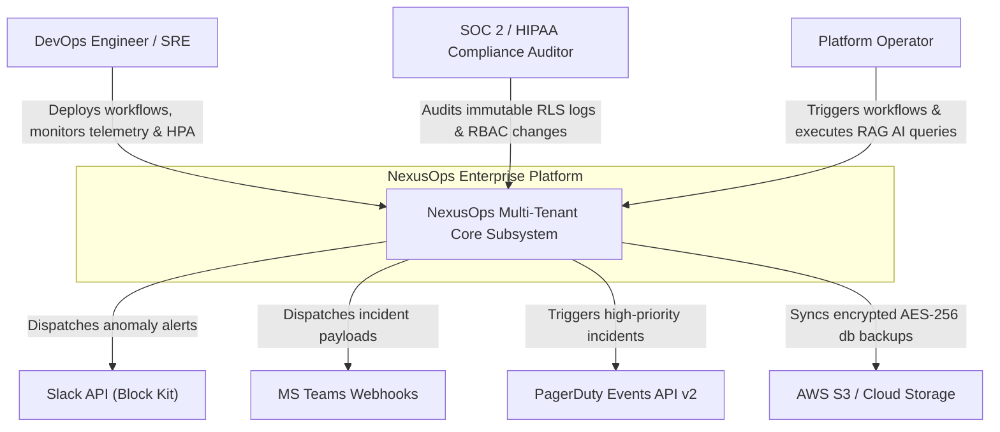
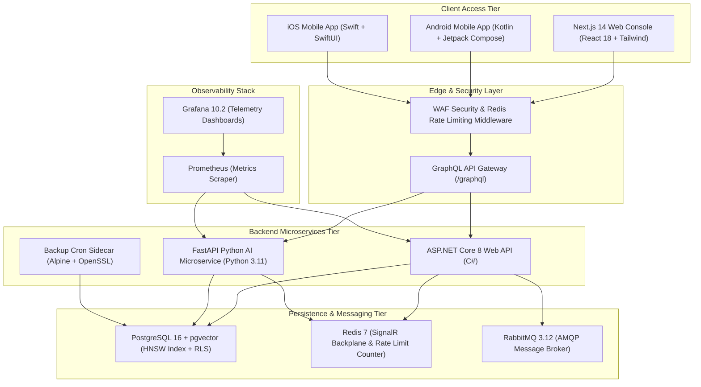
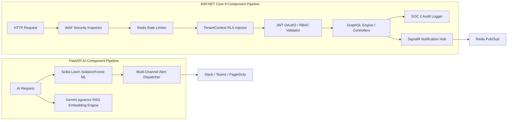
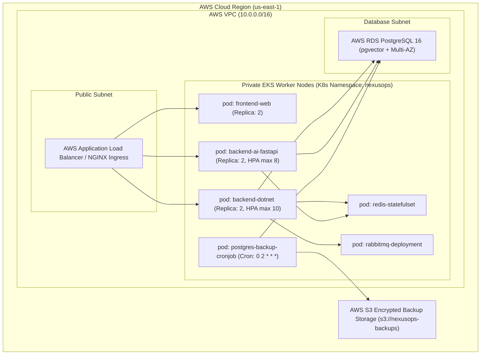

# NexusOps Enterprise - Complete Architecture Portfolio & C4 Diagrams

Welcome to the authoritative technical blueprint and architectural specification for **NexusOps Enterprise Platform v2.4**.

---

## 1. C1: System Context Diagram

The System Context diagram illustrates how external human actors and enterprise third-party services interact with the NexusOps Enterprise platform.



---

## 2. C2: Container Diagram

The Container diagram illustrates the high-level microservices, data stores, mobile applications, and event brokers composing NexusOps Enterprise.



---

## 3. C3: Component Diagram

The Component diagram inspects internal pipelines inside the ASP.NET Core API Gateway and FastAPI AI microservice.



---

## 4. C4: Deployment Diagram (AWS EKS & Hybrid Kubernetes)

The Deployment diagram maps physical/cloud infrastructure resources on AWS EKS and Kubernetes.



---

## 5. Enterprise Operator Runbook & SLA Directives

### Operational High Availability & Resilience SLAs
* **System Uptime Target**: 99.99% High Availability
* **Database Recovery Point Objective (RPO)**: < 5 Minutes (Point-in-Time Recovery via WAL)
* **Database Recovery Time Objective (RTO)**: < 2000 ms (Automated Connection Pool Teardown)
* **Rate Limiting Policy**: 100 requests / minute / tenant (Burst buffer: 20 req)
* **Security WAF Enforcement**: Active inspection on Query Parameters, Headers, and JSON Payloads for SQLi, XSS, and Path Traversal.

### Emergency Incident Commands
1. **Trigger Manual Database Backup**:
   ```bash
   ./devops/scripts/backup_restore.sh backup
   ```
2. **Execute Full Chaos Engineering Resilience Assessment**:
   ```bash
   ./devops/scripts/chaos_runner.sh full-assessment
   ```
3. **Verify WAF Security & Detailed Microservice Health**:
   ```bash
   curl -s http://localhost:5050/api/health/detailed | jq .
   ```
